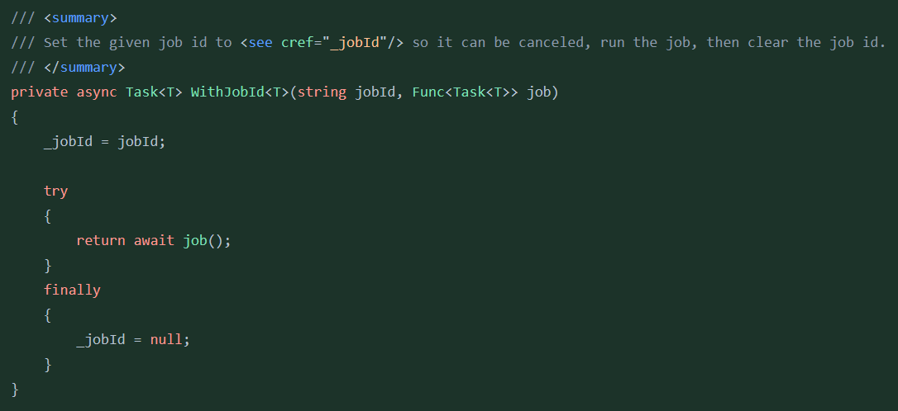

This is a user style that makes BitBucket code diff look like the Visual Studio dark theme.

### Disabled

### Enabled

## Interfaces
To style C# interfaces correctly (e.g. `IThing`), also install the Tampermonkey script. On BitBucket pages, it waits until the DOM finishes rendering, then scans diffs for classes starting with `I` and applies the CSS class `interface` to them, which the Stylus script will then style to look like an interface in Visual Studio.

## Limitations

Generics do not always look correct, e.g. for `Task<T>` or `IEnumerable<Thing>`, the code inside `< >` might not always have the right color.
